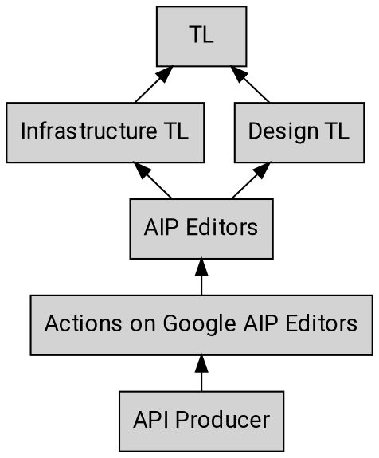

# Actions on Google AIPプロセス

このAIPは[AIP-1][]を拡張し、Actions on Google AIPに固有の詳細を追加する。[AIP-1][]のうち、このAIPによって修正または矛盾しない詳細は、Actions on Google AIPにも適用される。

## ステークホルダー

他のプロセスと同様に、AIPのレビューと作業には多くの異なるステークホルダーが存在する。以下は、APIプロデューサーから始まるエスカレーションパスの概要である。

### Actions on Googleエディター

Actions on Googleエディターは、[AIP-1][]で定義されている一般エディターにエスカレーションする前に、Actions on Google AIPに関する決定を行う人々の集合である。

現在のActions on Google AIPエディターのリストは以下の通りである：

- Ali Ibrahim ([@ahahibrahim][])
- Richard Frankel ([@rofrankel][])
- Shuyang Chen ([@Canain][])

Actions on Googleエディターは、一般エディターと同じ責任を負う。さらに、Actions on Google AIPの内容の正確性とリーダーシップの支持を確立する責任も負う。

Actions on Google AIPエディターシップは、現在のActions on Googleエディターからの招待による。

[aip-1]: ../0001.md
[@ahahibrahim]: https://github.com/ahahibrahim
[@rofrankel]: https://github.com/rofrankel
[@canain]: https://github.com/Canain
