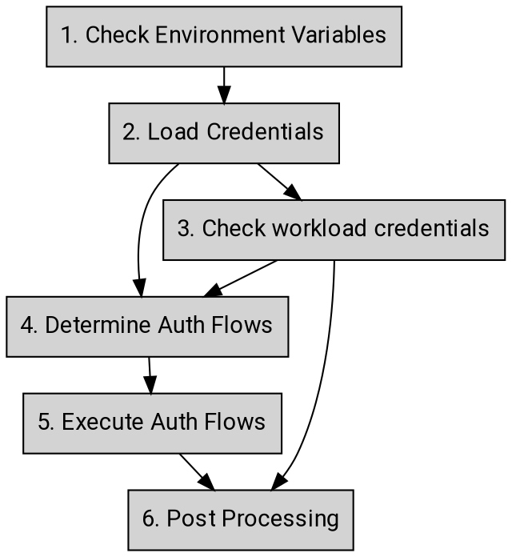

# アプリケーション デフォルト クレデンシャル

Googleの認証ライブラリは、_Application Default Credentials（ADC）_ と呼ばれる戦略を使用して、環境やコンテキストに基づいてクレデンシャルを検出・選択する。ADCを使用することで、開発者は異なる環境でコードを実行でき、サポートシステムが各環境に適したクレデンシャルを簡単に取得できる。

これらのAIPの標準に従う認証ライブラリは _"Google Unified Auth Clients"_、略して _GUAC_ として知られている。結果として得られるライブラリは通称 _GUAC_ と呼ばれる。

**注:** このAIPは言語に依存しない形でガイダンスと要件を説明するため、特定の言語や環境では不正確または不適切となる可能性がある一般的な用語を使用している。

## ガイダンス

### クレデンシャルの種類

本セクションでは、ADCがサポートするクレデンシャルの種類について説明する。

- **Gcloud Credential**: [Gcloudツール][0]によって提供されるクレデンシャルであり、Google APIにアクセスするために認証を必要とする人間のユーザーを識別する。認証ライブラリはこのクレデンシャルタイプをサポート**しなければならない**（must）。

- **Service Account Key**: Google APIにアクセスするために認証を必要とする非人間ユーザーを識別するクレデンシャルである。認証ライブラリはこのクレデンシャルタイプをサポート**しなければならない**（must）。

- **OAuth Client ID**: [3-legged OAuthフロー][1]を通じて人間のユーザーがサインインできるようにするクライアントアプリケーションを識別するクレデンシャルであり、その人間ユーザーに代わってGoogle APIにアクセスする権限をアプリケーションに付与する。認証ライブラリはこのクレデンシャルタイプをサポート**してもよい**（may）。

- **External Account Credential**: Googleのアクセストークンと交換してGoogle APIにアクセスできる[外部のGoogle以外のクレデンシャル][8]を識別する設定ファイルである。認証ライブラリはこのクレデンシャルタイプをサポート**しなければならない**（must）。

### 環境変数

認証ライブラリは、開発者がアプリケーションの認証設定を提供できるように、以下の環境変数をサポート**しなければならない**（must）：

- **GOOGLE_APPLICATION_CREDENTIALS**: 指定された値は、ADCがクレデンシャルファイルを特定するためのフルパスとして使用される。クレデンシャルファイルは以下のタイプのいずれかである**べきである**（should）：

  - Gcloud credentials
  - Service account key
  - External account credentials

  クレデンシャルは、認証ライブラリでサポートされている場合、OAuth Client IDであって**もよい**（may）。プログラムレベル（例：クライアントオプション経由）で指定されたクレデンシャルファイルのパスは、この環境変数の値より優先**しなければならない**（must）。

- **GOOGLE_API_USE_CLIENT_CERTIFICATE:** 指定された値はtrueまたはfalseで**なければならない**（must）。この変数がfalseに設定されている場合、クライアント証明書は無視**しなければならない**（must）。値が設定されていない場合のデフォルトはfalseである。

```
GOOGLE_API_USE_CLIENT_CERTIFICATE=[true|false]
```

- **GOOGLE_CLOUD_QUOTA_PROJECT:** クレデンシャルに設定するクォータプロジェクトIDである。この環境変数の値は、ADCメカニズムによって検出されたクレデンシャルに含まれるクォータプロジェクトを上書きする。

### 入力と出力

入出力の観点から見ると、_ADC_ への入力はクレデンシャル、および環境変数やこれらのクレデンシャルを提供するメタデータサービスなどの基盤となる環境である**べきである**（should）。

例えば、`GOOGLE_APPLICATION_CREDENTIALS`環境変数はデフォルトのクレデンシャルJSONを入力として提供できる。あるいは、gCloudがデフォルトのユーザークレデンシャルJSONを保存するために使用するwell-knownパスも同様である。出力は、アプリケーションがGoogle APIにアクセスするために使用できるアクセストークンである。このアクセストークンは、選択された認証フローに応じて、bearerトークン、証明書バインドトークン、またはアイデンティティバインドトークンであって**もよい**（may）。

## 期待される動作

本セクションでは、ADCの期待される動作について説明する。認証ライブラリは、完全であると見なされるためにこれらの概念を実装**しなければならない**（must）。



1. **環境変数の確認**
   1. GOOGLE_APPLICATION_CREDENTIALSを確認
     1. 設定されていれば、ステップ(2.2)へ
     1. 設定されていなければ、ステップ(2)へ
1. **クレデンシャルの読み込み**
   1. [gcloudデフォルトクレデンシャル][5]をデフォルトパスから確認
     1. 見つかれば、ステップ(2.2)へ
     1. それ以外はステップ(3)へ
   1. 提供されたクレデンシャルタイプを確認
     1. クレデンシャルがgcloud credentialsの場合、ステップ(4)へ
     1. クレデンシャルが[サービスアカウントキー][6] JSONの場合、ステップ(4)へ
     1. クレデンシャルが[外部アカウント][8] JSONの場合、ステップ(4)へ
     1. クレデンシャルが未知のタイプの場合、エラーを返して _[END]_
   1. クレデンシャルが見つからない _[END]_
1. **ワークロードクレデンシャルの確認（GCE、GKE、GAEおよびServerless環境）**
   1. trueの場合、
     1. [mTLS Token Binding][9]の要件を満たすことでアイデンティティバインディングが有効になっている場合、mTLS Token Bindingフローを使用してアイデンティティバインドアクセストークンを取得する。ステップ(6)へ。
     1. バインドトークンの取得に問題がある場合、エラーを返して _[END]_
     1. アイデンティティバインディングが有効でない場合、[仮想マシンフロー][3]を使用して現在の環境に関連付けられた認証トークンを取得する
       1. 開発者によってターゲットaudienceが提供されている場合、[アイデンティティトークン][7]を取得する。ステップ(6)へ。
       1. それ以外の場合、アクセストークンを取得する。ステップ(6)へ。
   1. falseの場合、ステップ(2.3)へ
1. **認証フローの決定**
   1. クレデンシャルがgcloud credentialの場合、ステップ(5.3)へ
   1. 開発者によってtarget audienceまたはscopeが提供されている場合、ステップ(5.1)へ
   1. クレデンシャルが外部アカウントの場合、ステップ(5.4)へ
   1. それ以外の場合、ステップ(5.2)へ
1. **認証フローの実行**
   1. 2LOフローを使用して認証トークンを交換する
     1. 開発者によってtarget audienceが提供されている場合、[アイデンティティトークン][7]を取得する。ステップ(6)へ。
     1. それ以外の場合、アクセストークンを取得する。ステップ(6)へ。
       1. クライアント証明書が提示されている場合、交換されたトークンは証明書バインドトークンになる。ステップ(6)へ。
   1. 自己署名JWTフローを使用してアクセストークンをローカルで生成する
     1. 証明書が提示されている場合、証明書をJWTに埋め込む。
     1. 通常の[自己署名JWTフロー][4]を使用してアクセストークンを取得する。ステップ(6)へ。
   1. ユーザーアイデンティティフローを使用してアクセストークンを交換する。ステップ(6)へ。
   1. [外部アカウント][8]フローを使用してアクセストークンを交換する。ステップ(6)へ。
1. **後処理**
   1. クォータプロジェクトの更新
     1. ADCの開始時にクォータプロジェクトが明示的に指定された場合、クレデンシャルのクォータプロジェクトをその明示的な値で上書きする。_[END]_
     1. それ以外で`GOOGLE_CLOUD_QUOTA_PROJECT`環境変数が設定されている場合、クレデンシャルのクォータプロジェクトをこの値で上書きする。_[END]_

## 変更履歴

- **2019-08-13**: 仮想マシンフロー（AIP 4115）へのリンクを追加。
- **2019-08-18**: ADCからSTSサポートを削除。
- **2021-01-20**: アイデンティティトークンフロー（AIP 4116）を追加。
- **2021-06-29**: GOOGLE_API_KEYのガイダンスは、合意が得られるまで一時的に削除。
- **2021-12-10**: 外部アカウントクレデンシャル（AIP 4117）を追加。
- **2023-01-23**: クォータプロジェクト環境変数を追加。


<!-- prettier-ignore-start -->
[0]: https://cloud.google.com/sdk/gcloud/reference/auth/application-default/login
[1]: https://developers.google.com/identity/protocols/oauth2/native-app
[3]: ./4115
[4]: ./4111
[5]: ./4113
[6]: ./4112
[7]: ./4116
[8]: ./4117
[9]: ./4119
<!-- prettier-ignore-end -->
