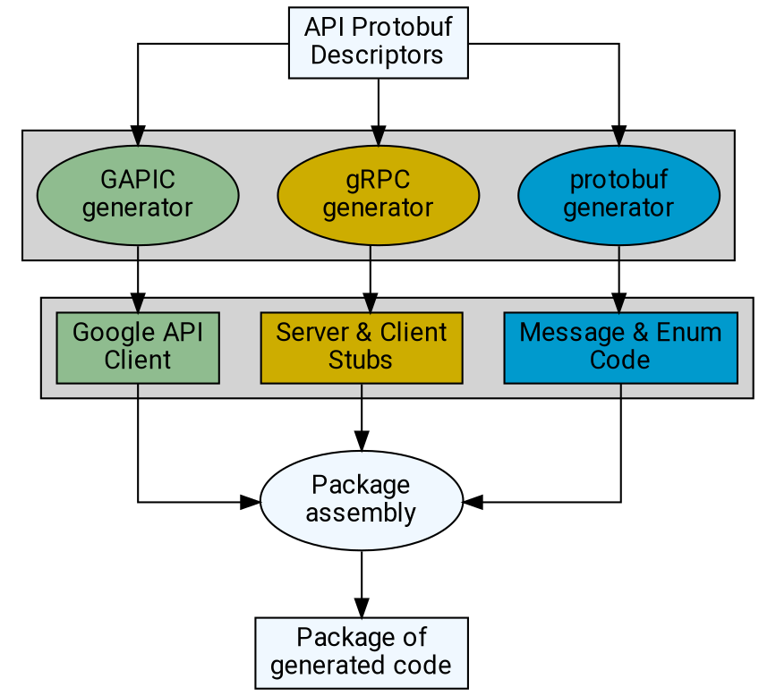

# Client library generators

APIガイドラインは、シンプルで直感的かつ一貫性のあるAPIを促進するために存在する。AIPガイダンスに概ね従うAPIに精通したユーザーは、以前のAPIで学んだことを新しいAPIにも適用できる。

Client library（クライアント ライブラリ）は、認証などの共通の関心事を簡略化し、言語ネイティブな方法でAPIエンドポイントを呼び出して言語ネイティブな応答を受け取る手段を提供することで、ユーザーがより迅速にAPIを使い始めるための仕組みを提供する。しかし、これらのライブラリが最大の価値を提供するには、シンプルで直感的かつ一貫性があることも必要である。コードジェネレータは、一貫性のあるclient libraryをスケールして生成する手段を提供する。

これらのAIPの標準に従うコードジェネレータを「generated API client generators」、略して _GAPIC generators_ と呼ぶ。生成されたライブラリは通称 _GAPIC_ と呼ばれる。

**Note:** このAIPは言語に依存しない形でガイダンスと要件を説明するため、特定の言語や環境では不正確または不適切となる可能性のある汎用的な用語を使用する（例えば、Goにはクラスがないにもかかわらず `class` という用語を使用するなど）。このAIPにおける特定の語彙の使用は、原則の説明として理解されるべきであり、このAIPの正確な語彙への厳密な準拠は期待されていない。

## Guidance

ほとんどのサポート対象言語におけるclient libraryおよびサポートコードのコード生成の一般的な流れを以下に示す。

**Note:** このパターンの例外は、通常、独自のスタックを使用していることに起因する。例として、Node.jsでの `protobuf.js` と `grpc-node` の使用（コード生成がない）、Pythonでの `proto-plus-python` におけるprotobufラッパーの使用などが挙げられるが、一般的なGAPICの流れは同じである。

以下のセクションでは、上記の図の「GAPIC generator」に焦点を当てる。

### Protobuf plugins

protobufコンパイラ `protoc` は、コード生成のための[プラグインシステム][0]をサポートしている。このプラグインシステムにより、任意の言語で _ および _ 向けにプラグインを記述できる。

コードジェネレータは**しなければならない**（must）`protoc` プラグインとして実装する。client libraryジェネレータを `protoc` プラグインとして実装する場合、以下のルールが適用される：

- プラグインは**すべきである**（should）ターゲットとなる生成言語で記述される。
- `protoc` はプラグインが `$PATH` 上の実行可能ファイルであり、`protoc` 実行可能ファイルに送られる `--{plugin_name}_out` オプションに対応して `protoc-gen-{plugin_name}` という名前であることを期待する。したがって：
  - プラグインの実行可能ファイルは**すべきである**（should）`protoc-gen-{lang}_gapic` と命名される。
  - プラグインオプションは**すべきである**（should）`--{lang}_gapic_out` という命名規則に従う。
- プラグインは**してはならない**（must not）`protoc` の「insertion points」を活用する。`protoc` プラグインのドキュメントがinsertion pointsの存在を示しているにもかかわらず、その使用はProtobufチームによってサポートされておらず推奨されていない。

### CLI options

コードジェネレータは**すべきである**（should）可能な限りオプションやフラグなしで実行でき、protoのみから有効なライブラリを生成できる。オプションが必要な場合、`protoc` は `--{plugin_name}_opt` として渡すことを許可しており、ここで指定された文字列が `CodeGeneratorRequest` の `parameter` 文字列として設定される。

**Important:** `CodeGeneratorRequest.parameter` の値は、実行時に関連する _すべての_ プラグインオプションの値をカンマ区切りで連結した文字列である。つまり、リスト状のプラグインオプションの値を区切るためにカンマを使用することはできない。

コードジェネレータは**してはならない**（must not）設定のために環境変数に依存する。

## Expected behavior

このセクションでは、client libraryジェネレータの _出力_ （つまり、ジェネレータが書き出すライブラリ）に期待される振る舞いの属性について説明する。client libraryは、完全であると見なされるためにこれらの概念を実装**しなければならない**（must）。

### Messages and Enums

client libraryジェネレータは**すべきではない**（should not）Protobuf提供のコードジェネレータによって既に生成されている `message` や `enum` ディスクリプタのコードを生成する。

### Services and methods

要求されたproto内の各 `service` および `rpc` ディレクティブは、言語やトランスポートがサポートできない場合を除き、client libraryの出力に表現**しなければならない**（must）。

**Note:** これを達成する方法は言語によって異なるかもしれないが、ほとんどの古典的な言語では、各サービスに対してクラスが作成され、各RPCに対するメソッドが含まれるだろう。

- 各 `service` ディレクティブに対して生成されるクラスは、`google.api.default_host` アノテーションが提供されている場合はそれを尊重**しなければならず**（must）、そのホストをデフォルトのホスト名として使用する。これらのクラスは**すべきである**（should）エンドユーザーがホスト名を上書きする仕組みを提供する。
  - `service` ディレクティブに `google.api.default_host` アノテーションが存在しない場合、生成されるクラスはインスタンス化時にホスト名を要求**すべきである**（should）。
- さらに、各サービスに対して生成されるクラスがOAuthおよびサービス資格情報の使用をサポートする場合、`google.api.oauth_scopes` アノテーション（提供されている場合）を尊重**しなければならず**（must）、これらのスコープをデフォルトで使用する。
- `deprecated` protobufオプションが `true` に設定されているサービスは、生成されるクラスに同等の非推奨タグを付与**すべきである**（should）。該当する場合、このタグにはサービスの削除予定時期（通常は次のメジャーバージョンアップデート）を指定するコメントを含めてもよい。同様に、このオプションが `true` に設定されているRPCは、生成された言語のメソッドを非推奨としてマーク**すべきである**（should）。
- 最後に、serviceクラスはクレデンシャルも受け入れ**しなければならず**（must）、リクエストを行う際に適切に使用される。（カスタムgRPCチャネルを受け入れることでこの要件を満たす。）
- コードジェネレータは**してはならない**（must not）client libraryクラスに加えて、通常gRPCによって生成されるクライアント _スタブ_ クラスを生成する。

### Long-running operations

<!-- TODO(1145): Move to its own client library AIP. -->

RPCの戻り値の型が [`google.longrunning.Operation`][3] である場合（かつその場合にのみ）、そのRPCは long-running RPC と見なされる。1つ以上のRPCが `Operation` を返すAPIは、`Operations` サービスを実装することが期待される。

[`Operation`][3] の `response` フィールドと `metadata` フィールドは [`google.protobuf.Any`][4] 型であるため、それらをデシリアライズするためにどのメッセージを使用するかを知る必要がある。これは、[`google.longrunning.operation_info`][5] アノテーションを使用してRPCにアノテーションされる。

**Note:** この構造体の値は _文字列_ であり、メッセージオブジェクトではない。コードジェネレータはその文字列を使用して、使用する適切なメッセージを判断する。ピリオド（`.`）文字を含まない文字列は、同じprotoパッケージ内のメッセージを参照する。

コードジェネレータは**すべきである**（should）[`operation_info`][5] アノテーションでインポートされていない型が指定された場合、またはレスポンス型やメタデータ型が提供されなかった場合、エラーで失敗する。コードジェネレータは**すべきである**（should）`response_type` または `metadata_type` キーの _いずれか_ が省略された場合、エラーで失敗する。

client libraryは**しなければならない**（must）LROインターフェースを尊重する。RPCの戻り値の型が [`Operation`][3] である場合、生成されたメソッドはそれをインターセプトし、LROを解決するための適切な慣用的オブジェクト（基盤となる [`Operation`][3] オブジェクトにバインドされた `Future` や `Promise` など）を返さ**なければならない**（must）。

### Streaming

client libraryは**しなければならない**（must）サポートするトランスポートが許可する範囲でストリーミングを実装する。RPCは、引数またはレスポンス型に `stream` キーワードが存在する場合にストリーミングと見なされる。これは [`MethodDescriptorProto`][6] メッセージ内の `client_streaming` キーと `server_streaming` キーを使用して表現される。

<!-- prettier-ignore-start -->
[0]: https://protobuf.dev/reference/other
[1]: https://github.com/google/protobuf/blob/master/src/google/protobuf/compiler/plugin.proto
[2]: https://github.com/google/protobuf/blob/master/src/google/protobuf/descriptor.proto
[3]: https://github.com/googleapis/googleapis/blob/master/google/longrunning/operations.proto#L122
[4]: https://github.com/protocolbuffers/protobuf/blob/master/src/google/protobuf/any.proto
[5]: https://github.com/googleapis/googleapis/blob/master/google/longrunning/operations.proto#L222
[6]: https://github.com/protocolbuffers/protobuf/blob/master/src/google/protobuf/descriptor.proto#L269
<!-- prettier-ignore-end -->

## Changelog

- **2023-06-22**: コード生成図、message/enumガイダンスを追加し、プラグインおよびオプションのガイダンスを整理。
