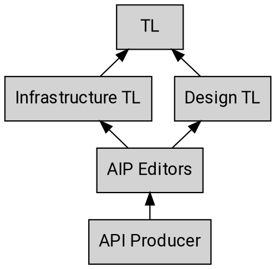
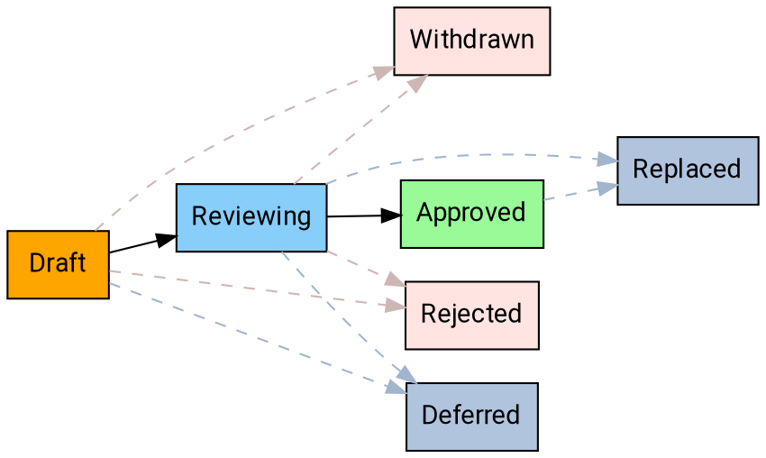

# AIPの目的とガイドライン

Google APIのコーパスが拡大し、APIガバナンスチームもそれらをサポートする需要に応えて成長するにつれて、APIプロデューサー、レビュアー、およびその他の関係者が参照するためのドキュメントのコーパスがますます必要になってきている。APIスタイルガイドとOne Platformの入門ドキュメントは、意図的に簡潔で高レベルなものとなっている。AIPコレクションは、API設計ガイダンスのための一貫したドキュメントを提供する方法を提供する。

## AIPとは何か

AIPとは**API Improvement Proposal**の略であり、API開発のための高レベルで簡潔なドキュメントを提供する設計文書である。GoogleにおけるAPI関連ドキュメントの信頼できる情報源として機能し、APIチームがAPIガイダンスについて議論し合意に達するための手段となる。AIPは[AIP GitHubリポジトリ][AIP GitHub repository]内でMarkdownファイルとして管理されている。

## AIPのタイプ

AIPにはいくつかの異なるタイプがあり、以下で説明する。AIPのタイプリストは、必要に応じて将来変更される可能性がある。

### ガイダンス

これらのAIPはAPI設計に関するガイダンスを説明する。APIプロデューサーがシンプルで直感的かつ一貫性のあるAPIを作成するための指示として提供され、APIレビュアーによるレビューコメントの基礎として使用される。

### プロセス

これらのAIPはAPI設計に関するプロセスを説明する。多くの場合、AIPプロセス自体に影響を与え、AIPの処理方法を強化するために使用される。

## ステークホルダー

どのようなプロセスにも多くの異なるステークホルダーが存在する。以下は、APIプロデューサーから始まるエスカレーションパスの概要である。

上記の図に示すように、TLがAIPプロセスにおける最終的な意思決定者であり、必要に応じて最終的なエスカレーション先となる。

### エディター

エディターはAIPに関する決定を行う人々のグループである。一般的な目標は、AIPプロセスが協力的であり、主にコンセンサスに基づいて進められることである。ただし、限られた数の指名された承認者が必要であり、これらのGooglerが一般的なスコープ内の各AIPの承認者となる。

現在のAIPエディターの一覧は以下の通りである：

- Angie Lin ([@alin04][])
- Jon Skeet ([@jskeet][])
- Jose Juan Zavala Iglesias ([@itsStrobe][])
- Louis Dejardin ([@loudej][])
- Noah Dietz ([@noahdietz][])
- Sam Levenick ([@slevenick][])
- Sam Woodard ([@shwoodard][])

エディターはまた、AIPを指導し、AIPパイプラインとワークフローを管理する管理的および編集的な側面にも責任を持つ。彼らはAIPへのPRを承認し、提案番号を割り当て、アジェンダを管理し、AIPの状態を設定するなどを行う。また、AIPが読みやすいこと（適切なスペル、文法、文章構造、マークアップなど）を保証する。

AIPエディターへの就任は、現在のエディターの招待によるものとする。

## ドメイン固有のAIP

一部のAIPは特定のドメインに固有のものとなる場合がある（例えば、特定のPA内のAPIのみ、あるいは特定のチームのみなど）。この場合、そのグループにはAIP-2に従って使用する特定のAIPブロックが割り当てられ、該当するAIPはそのスコープを明確に示す。

## 状態

任意の時点で、AIPはプロセスを進むにつれてさまざまな状態に存在する可能性がある。以下は各状態の概要である。

### Draft

AIPの初期状態は"Draft"状態である。これは、AIPが主に元の著者によって議論され、反復されていることを意味する。エディターがこの段階で関与することは_may_あるが、必須ではない。

**注:** 重要な高レベルの反復が必要な場合は、PRではなくGoogleドキュメントでAIPをドラフトすることが推奨される。GoogleドキュメントからAIPシステムに移行されたAIPは、十分な承認がある場合、draft状態をスキップして直接レビューに進んで**してもよい**（may）。

### Reviewing

AIPに関する議論がおおむね終了したが、正式に承認される前の段階で、"Reviewing"状態に移行する。これは、著者が提案についておおむねコンセンサスに達し、エディターが関与していることを意味する。この段階では、エディターは先に進む前に変更を要求したり、代替案を提案したりすることがある。

**注:** 正式な事項として、1人のAIP承認者（著者以外）がAIPをreviewing状態に進めるために正式な承認を提供**しなければならない**（must）。さらに、他の承認者からの正式な異議（GitHub PRでの"changes requested"）があっては**してはならない**（must not）。

### Approved

承認されたAIPが合意に達すると、"approved"状態になり、"best current practice"と見なされる。

**注:** 正式な事項として、2人のAIP承認者（著者以外）がAIPをapproved状態に進めるために正式な承認を提供**しなければならない**（must）。さらに、他の承認者からの正式な異議（GitHub PRでの"changes requested"）があっては**してはならない**（must not）。

### Withdrawn

AIPが著者またはチャンピオンによって取り下げられた場合、"withdrawn"状態になる。取り下げられたAIPは、別のチャンピオンが引き継ぐことができる。

### Rejected

AIPがAIPエディターによって却下された場合、"rejected"状態になる。却下されたAIPは残り、将来の議論に情報を提供するためのドキュメントと参照を提供する。

### Deferred

AIPが長期間にわたって行動されていない場合、エディターはそれを"deferred"としてマークすることがある。

### Replaced

AIPが別のAIPによって置き換えられた場合、"replaced"状態になる。AIPエディターは、置き換えとその根拠を説明する通知を提供する責任がある（置き換えるAIPもその根拠を明確に説明すべきである）。

一般的に、APIプロデューサーは主に"approved"状態のAIPに依存すべきである。

## ワークフロー

以下のワークフローは、AIPを提案し、AIPを提案から実装、最終承認まで進めるプロセスを説明する。

### 概要

### AIPの提案

AIPを提案するには、まず[issueを開き][open an issue]、基本的なアイデアを周知して初期フィードバックを得る。通常、アイデアは数ページで説明できるはずである。

新しいAIPを提案する、または既存のAIPへの変更を提案する際には、提案が影響を与える先行事例やユースケースを参照することが最善である。これにより、提案が現実的な問題空間に基づいていることが保証される。したがって、提案は具体的な参照や明確に定義された例を提供**すべきである**（should）。適切な資料には以下が含まれるが、これらに限定されない：

- 既存の外部RFCや標準
- 同様のパターンに準拠しているAPIのコーパス（`Search`メソッドなど）
- まだ解決されておらず、1つ以上のAPIに存在する、または存在し得る具体的なユースケース（例：AIP-143 Unicode CLDRリージョンコードのためのAIP-202 Formatの追加）

準備ができたら、`aip/new.md`というファイル名でAIPディレクトリに新しいファイルを含むPRを作成する。PRがメンテナーによって編集可能であることを確認する。

ほとんどの場合、エディターは提案にAIP番号を割り当て、AIPを"Reviewing"状態でPRを提出する。エディターは、明白な理由がある場合（例：提案がすでに別のAIPで議論され却下されている、または根本的に妥当ではない）、AIPを即座に却下することがあり、その場合はPRはマージされない。

### AIPの議論

PRがマージされると、AIPの著者はフォローアップ承認PRでAIPを推進する責任を負う。これは、著者が提案に関するコンセンサスを推進する責任があることを意味する。これには、APIガバナンスチームの定例会議での議論が含まれることがある。

AIPの著者は、議論の過程でPRにフォローアップコミットを提出することにより、AIPを修正することができる。

### AIPの承認

エディターは協力して、適格な提案がレビューで滞留しないようにする。

最終承認を得るためには、AIPは、最低でも、AIPがカバーするドメイン（設計またはインフラストラクチャ）に責任を持つTLと、少なくとも1人の他のエディターによって承認され**なければならず**（must）、かつアクティブに変更を要求しているエディターがいてはならない。

**注:** AIPエディターがAIPの主著者である場合、少なくとも2人の_他の_エディターがそれを承認しなければならない。

AIPが承認されると、エディターはAIPの状態を更新してそれを反映し、PRを提出する。

### AIPの取り下げまたは却下

AIPの著者は、さらなる検討の結果、AIPを進めるべきでないと判断する場合がある。その場合、著者はPRを更新して取り下げ通知とその根拠の説明を追加することにより、AIPを取り下げることができる。また、著者がグループ内でコンセンサスを得られず、AIPエディターがAIPを却下することを選択する場合もある。この場合、AIPエディターはPRを修正して却下通知とその根拠の説明を追加するものとする。どちらの場合も、AIPエディターは状態を適宜更新し、PRを提出する。

### AIPの置き換え

稀なケースでは、AIPを別のもので置き換える必要がある場合がある。これは一般的な慣行ではない。承認されたAIPへの軽微な編集は許容され、ガイダンスを微調整する一般的な方法となる。しかし、新しいガイダンスが古いガイダンスを何らかの形で根本的に変更する場合、AIPエディターは新しいAIPを作成し、承認されたら古いものを置き換えるものとする。古いものは"Replaced"状態になり、新しい現在のAIPにリンクする。

## 変更履歴

- **2025-01-09**: 提案に参照/例を含める要件を追加。
- **2024-09-04**: 現在のエディター名を更新し、TLを削除。
- **2023-05-10**: 現在のエディターとTLの名前を更新。
- **2019-07-30**: AIPの定足数要件をさらに明確化。
- **2019-05-12**: AIP承認者とエディターを1つの役割に統合し、完全定足数からの承認ルールを緩和。
- **2019-05-04**: AIPを内部プロセスではなくGitHubプロセスを参照するように更新。

[aip github repository]: https://github.com/googleapis/aip
[open an issue]: https://github.com/googleapis/aip/issues
[@alin04]:https://github.com/alin04
[@jskeet]: https://github.com/jskeet
[@loudej]: https://github.com/loudej
[@noahdietz]: https://github.com/noahdietz
[@slevenick]: https://github.com/slevenick
[@shwoodard]: https://github.com/shwoodard
[@itsStrobe]: https://github.com/itsStrobe
