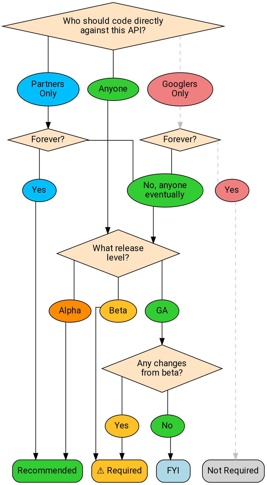

# API設計レビューFAQ

API設計レビューは、APIコーパス全体でシンプルで直感的かつ一貫性のあるAPI体験を保証するために存在する。

## API設計の承認は必要か？

**要約:** ベータ版またはGA品質レベルでユーザーがコードを書けるAPI（現在または将来）をローンチする場合、通常API設計の承認が必要である。

API設計レビューは基本的に、ユーザーにシンプルで一貫性のある体験を提供することを確実にするためのものであり、したがってユーザーが直接コードを書くAPIに対してのみ期待される。

以下のフローチャートは、APIが設計レビュープロセスを必要とするかどうかを示している：

### 誰が直接コードを書くべきか？

より複雑な質問の1つは、「誰がこのAPIに対して直接コードを書くべきか？」である。API設計レビューは主にAPIのオーディエンスに関係する。つまり、誰がサービスに対して独自のHTTP/gRPC呼び出しを書くことを許可されているか、誰がドキュメントを見ることができるかに関心がある。（サービスがパブリックネットワークに公開されているかどうかといった質問には関心が**ない**。）

一般のユーザーがドキュメントを読み、サービスと対話するコードを書くことが意図されている場合、設計レビューが必要である。

以下の状況は設計レビューを**必要としない**：

- 今後もGooglerのみ、または内部ツール（例：Pantheon）によってのみ使用されるAPI。
- Googleがリリースする実行可能プログラムによってのみ呼び出されるAPI（APIが実行可能ファイルからリバースエンジニアリング可能であっても）。
- 契約下の単一の顧客または小規模な顧客セットによってのみ呼び出され、それ以上広く利用可能になることが**決してない**API。（この場合でも設計レビューは推奨されるが、必須ではない。）

### Alpha

Alphaの場合、API設計レビューはオプションだが推奨される。顧客から迅速に初期フィードバックを得るために努力することはしばしば理にかなっており、alphaのローンチはユーザビリティの質問に対する最適な答えを決定するためのデータを得る方法となり得る。そのため、レビューを省略することが得策な場合もある。一方で、alphaのローンチには実装の構築が必要であり、ベータ段階でのAPI設計レビューで懸念が提起された場合、その実装を更新するためのエンジニアリング作業が発生する。API設計レビューは実装作業に先行できるため、alphaでも設計レビューを推奨する。

## 設計レビューが重要なのはなぜか？

**要約:** プロダクトの優秀性。

設計レビュープロセスは、顧客に提供するAPIが**シンプル**で**直感的**かつ**一貫性**があることを保証するために存在する。レビューアは、あなたのAPIを初心者のユーザーの立場からアプローチし、APIが提供するリソースとアクションを検討し、サーフェスを可能な限りアクセスしやすく拡張可能にしようと試みる。

設計レビューアはAPIを評価するだけでなく、APIがGoogleの既存のAPIコーパスと一貫性があるかを確認する。多くの顧客は複数のAPIを使用しており、したがって、私たちの規約と命名の選択が顧客の期待と一致していることが重要である。

## 何を期待すべきか？

### レビュープロセスにはどのくらい時間がかかるか？

レビューアは割り当てられたレビューに迅速に対応し、不必要な遅延を防ぐために頻繁にフィードバックを提供するよう努めているが、遅延が発生した場合に備えて、一般的には早めにレビュープロセスを開始するのが最善である。

設計レビュープロセスは、基礎となるAPIサーフェスの規模と複雑さによって異なる：

- 既存APIへの段階的な変更は、通常数日かかる。
- 小規模なAPIは通常約1週間かかる。
- 大規模なサーフェスを持つ完全に新しいAPIは、少なくとも1週間以上かかる傾向がある。非常に大規模なサーフェスを持つ場合（例：Cloud AutoML）、レビューには1ヶ月以上かかることもある。

### レビューアはどのようにして私のAPIにアプローチするか？

APIレビューアは、主にAPIサーフェスとそのユーザー向けドキュメントに焦点を当てることで、ユーザーと同じ方法でAPIにアプローチしようとする。理想的な世界では、APIレビューアはユーザーが尋ねるであろう種類の設計上の質問をし（そしてそもそもそのような質問が少なくなる方向にAPIを誘導する）。

### 先例とは何か？

一般的に、Google APIは可能な限り一貫性を持つことを望んでいる。顧客が最初のGoogle APIを学べば、同じパターンを一貫して使用しているため、2つ目（そして3つ目、それ以降）を学ぶのが容易になるはずである。

**先例**とは、以前のAPIによって既に行われた決定を指し、一般的には類似した状況での新しいAPIに対して拘束力を持つべきである。この最も一般的な例は命名である。[standard fields][]のリストがあり、`name`、`create_time`などの一般的な用語の使用方法、および同じ概念に常に同じ名前を付けることを規定している。

先例は_パターン_にも適用される。すべてのAPIは同じ方法でページネーションを実装すべきである。long-running operation、インポートとエクスポートなども同様である。パターンが確立されたら、それが適切な場所ではどこでも同じ方法で実装することを目指す。

## どうすればよいか？

### ...タイトな期限でローンチする場合？

最も良い方法は、できるだけ早期に設計レビューを依頼することである。さらに、レビューアにスケジュールを伝え、認識してもらい、可能な限り最善のサービスを提供できるようにすることである。可能であれば、期限を守ってほしいと**思っている**。

時間的に敏感な_alpha_ローンチの場合、APIは設計レビューの承認なしでローンチして**してもよい**（may）。そのようなローンチは、既知のユーザーセットに限定**しなければならない**（must）。この場合、レビューアはAPIチームが後続のステージで検討するためのノートを提供する。

**警告:** 不完全な設計レビューでalpha版のAPIをローンチしても、そのAPIの決定が永続的に確定するわけではない。APIをベータに昇格させるには設計レビューが必要であり、問題がある場合はAPIレビューアがベータローンチをブロックする。

alpha以降のローンチ段階では、ユーザー体験への影響を考慮し、API設計レビューは必須である。チームの不整合は、そのチームだけでなく、より広い範囲に影響を与える。

場合によっては、プロダクトの優秀性とエンジニアリング労力や期限の間に難しい選択を迫られることがある。これらは難しいビジネス上の判断であり、時には必要であることを理解している。しかし、設計レビューを省略したりレビューアのフィードバックを無視することを選択する場合、ディレクターまたはVPがプロダクトの優秀性よりもこれらの他の懸念を優先する明示的な選択を**しなければならない**（must）。

### ...レビューを早く進めるには？

いくつかのヒント：

- できるだけ早期にAPIレビューを開始し、頻繁にフォローアップする。
- 事前に[API linter][]を実行する。（linterを無効にする箇所がある場合は、その理由を説明すること。レビューアは、linterがその役割を果たしたために無効にされていることをしばしば見つける。）
- すべてのメッセージ、RPC、フィールドに_有用な_コメントが付いていることを確認する。コメントは有効なアメリカ英語で、意味のある内容であるべきである。
- APIレビューアに何かの説明を求められた場合、コードレビューの会話ではなく、protoコメントに説明を追加すること。これにより、往復の手間が大幅に削減されることが多い。

### ...APIレビューアの1人が応答しない場合？

Chatでレビューアに連絡する。それでもダメな場合は、もう1人のレビューアに連絡すると、適宜調整が行われる。それもダメな場合は、[AIP-1][]に従ってエスカレーションする。

### ...設計に関する質問がある場合？

最初に確認すべき場所は、[API style guide][]、[AIP index][]、およびGoogle内の他の公開APIである。他の公開APIは特に価値がある。誰かがあなたの質問に関連する状況に遭遇したことはよくあることである。

### ...そこにカバーされていない質問がある場合？

api-design@google.comに質問を送信する。

これは、API設計に関する特定の質問についてガイダンスを求めている場合、およびユースケースを明確に説明し例を提供する場合に最も効果的である。

**注:** このリストのメンバーはほぼ完全にボランティアであり、その時間の大半を他の業務に費やしている。私たちは可能な限り迅速に対応するよう努めているが、辛抱強く待っていただきたい。

### ...質問が複雑でCLで行き詰まっている場合？

コードレビューインターフェースは、実用的な場合に質問を解決する最良の方法であるが、時にコードレビューツールで解決するには十分に複雑な問題がある。このような状況では、レビューアに連絡してミーティングを設定するよう依頼する。一般的に、ほとんどの問題は30分で議論できる。

これが発生した場合、誰かがCLで議論された内容を文書化し、履歴が保存されるようにする。

### ...APIが標準に違反する必要がある場合？

API設計ガイドラインに違反していることとその理由を、（proto内の内部コメントを使用して）明確に文書化する。このコメントは`aip.dev/not-precedent`でプレフィックス**しなければならない**（must）。

一般的に、設計ガイドライン違反の理由は、[AIP-200][]に列挙された理由のいずれかに準拠**すべきである**（should）。そうでない場合は、APIレビューアと協力して最善の対応を決定する。

### ...レビューアが以前に解決済みの問題を持ち出している場合？

APIの以前の段階とは異なるレビューアの場合、これが発生する可能性がある。一般的に、最善のアプローチは、問題が決定されたコードレビューを参照することである。レビューアはあなたに手戻りを発生させることを避けたいため、通常は以前のレビューを尊重する。これで通常は問題は迅速に解決される。

まれに、レビューアが以前のレビューアが重大な間違いを犯したと考え、その修正が重要であると判断する場合がある。この場合、あなたとレビューアは協力して最善の対応を決定すべきである。

### ...チームとレビューアが強く対立している場合？

[AIP-1][]に従ってエスカレーションする。

## 私のPAやチームに特定のガイドラインはあるか？

Cloud PAには、Cloud全体でのさらなる統一性を確保するための特定のガイドラインがあり、Cloud APIには独自のレビューアプールがある。他のチームも同様の（ただし必ずしも同一ではない）ルールとシステムを採用することがある。複数のAPIを生成するチーム（例：機械学習）にも、そのAPIグループに適用されるガイドラインがある場合がある。

すべての場合において、これらのガイドラインをAIPとして利用可能にするよう努めている。より大きなAIP番号は特定のPAおよびチームの使用のために予約されており（[AIP-2][]参照）、これらのAIPは[AIP index][]にリストされている。

[aip-1]: ./0001.md
[aip-2]: ./0002.md
[aip-200]: ./0200.md
[aip index]: /
[api linter]: https://github.com/googleapis/api-linter
[api style guide]: https://cloud.google.com/apis/design/
[standard fields]: https://cloud.google.com/apis/design/standard_fields
